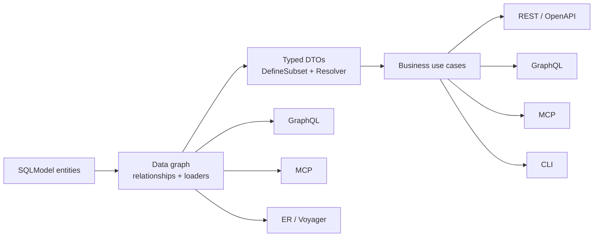

# nexusx

[](https://pypi.python.org/pypi/nexusx)
[](https://pepy.tech/projects/nexusx)

> **A framework for building MCP-first, Agent-first applications — declare
> your SQLModel entities once; MCP, GraphQL, REST, CLI, and a TypeScript
> SDK all derive from that single model.**

nexusx is a Python framework for building **MCP-first, Agent-first
applications** on SQLModel. You declare entities + relationships,
`DefineSubset` DTOs, and use-case methods; nexusx derives every delivery
protocol from that one model — sharing one DataLoader-backed query graph
(N+1-proof) and the same typed DTOs everywhere. Its specialty: **APIs that
agents understand easily** — an agent can always see what data exists,
explore the API piece by piece, and fetch only the fields it needs, so the
context window is spent on your data, not on decoding the interface.

What it removes: in a typical FastAPI + SQLModel app you re-declare the same
data shape for each transport — response models, GraphQL types, MCP tool
schemas, CLI arguments. nexusx collapses those re-declarations into one.

| You declare | nexusx generates |
|---|---|
| SQLModel entity + relationships | GraphQL schema + DataLoader batching (N+1-proof) + ER diagrams |
| `DefineSubset` DTO | Minimal-column queries + nested relationship loading + computed fields |
| `UseCaseService` method | REST route + GraphQL field + MCP operation + CLI command |
| A non-ORM async batch function | A relationship that joins the same loaders, DTOs, and ER diagrams |
| Entity `__federation_keys__` | Cross-service federation (auto-detected + batch-fetched) |

**For AI** — nexusx builds **agent-first APIs**: MCP is a first-class protocol
with **strong typing** and **GraphQL under the hood**. Three capabilities make
an API easy for agents to use:

- **See what data exists** (field awareness) — the schema describes every
  type, field, and relationship with exact names and types, so an agent
  always knows what the data looks like and what it can query.
- **Explore the API piece by piece** (progressive disclosure) — the schema is
  revealed on demand, layer by layer (app → service → method), so an agent
  never has to load the whole schema into its context window up front.
- **Fetch only what is needed** (field selection) — an agent asks for the
  exact fields it wants; one MCP call returns the whole nested result, with
  nothing extra.

In short: the agent always has enough context to understand the data, and
only pulls back what it needs — context is spent on your business data, not
wasted. See [MCP & context efficiency](docs/mcp-context-efficiency.md) for
the details.

**For Human** — write SQLModel entities + typed DTOs; get REST routes, GraphQL
schema, CLI, and TS SDK without boilerplate. Change business logic once → all
protocols update in sync.

## Installation

```bash
pip install nexusx
```

Optional integrations:

```bash
pip install "nexusx[demo]"        # Quick start: FastAPI, uvicorn, aiosqlite
pip install "nexusx[fastmcp]"     # MCP servers
pip install "nexusx[federation]"  # Cross-service composition
pip install "nexusx[cli]"         # Typer CLI generation
```

nexusx requires Python 3.10 or newer.

## Build an application with a single prompt

The fastest start is not writing code at all. The
[nexusx-4phase skill](skills/nexusx-4phase/) gives your coding agent a staged
workflow over nexusx: first confirm the domain model, then build entities,
GraphQL, and use-case APIs (REST / MCP / CLI), with an optional TypeScript
SDK at the end. Install it with the open skills CLI (works with Claude Code,
Codex, Cursor, and more):

```bash
npx skills add KLR-Pattern/nexusx -s nexusx-4phase -a claude-code
```

Then describe the application you want. The prompt below is the actual
prompt that kicked off
[MindMap X](https://github.com/allmonday/mindmap-x) (translated from the
original Chinese):

```text
/nexusx-4phase

Core requirements:

- A mind map / tree editor
- Humans can edit directly in a graphical interface
- Agents can read and modify the same tree
- Human and agent edits are visible to each other immediately
- Self-hosted
- Can be started or invoked directly from agent environments
  like Claude Code or Codex

Ideal state: start it with one command inside the agent, then let the agent
reason about and modify the mind map while the human keeps editing in the
browser at the same time.
```

The result is a complete, self-hosted application: a browser canvas for
humans, an MCP server for agents — Claude Code joins the same tree with one
command (`claude mcp add --transport http mindmap http://localhost:8740/mcp`)
— plus CLI and REST on the same operations, all derived from one nexusx
model. Humans and agents co-edit one tree and see each other's changes in
real time. See the
[MindMap X repository](https://github.com/allmonday/mindmap-x) for the full
source.

## Why nexusx

A SQLModel application usually grows through the same stages:

1. Define entities and relationships.
2. Write resolvers or joins to read nested data.
3. Create response DTOs that do not expose every database column.
4. Repeat the same business operation for REST, GraphQL, and AI tools.
5. Rebuild the relationship map again for documentation and service boundaries.

nexusx keeps those stages connected: each artifact you declare feeds the next
one and every delivery protocol at once, instead of being re-declared per layer.
The result is less translation code between your database, application layer,
web API, and AI interface.



The Quick start below works this way: two entity declarations become a GraphQL
schema, query roots, and a batched relationship loader — without a
hand-written GraphQL type or resolver. The same pattern extends to every layer,
from the data graph up to use cases and federation.

## Quick start

Install `nexusx[demo]` (see [Installation](#installation)) and create `app.py`.
The model is two entity declarations plus one handler — no GraphQL types, no
resolvers:

```python
from sqlmodel import Field, Relationship, SQLModel

from nexusx import AutoQueryConfig, GraphQLHandler


class BaseEntity(SQLModel):
    pass


class Team(BaseEntity, table=True):
    id: int | None = Field(default=None, primary_key=True)
    name: str
    heroes: list["Hero"] = Relationship(back_populates="team")


class Hero(BaseEntity, table=True):
    id: int | None = Field(default=None, primary_key=True)
    name: str
    team_id: int | None = Field(default=None, foreign_key="team.id")
    team: Team | None = Relationship(back_populates="heroes")


handler = GraphQLHandler(
    base=BaseEntity,
    session_factory=session_factory,  # async SQLAlchemy sessions — full file below
    auto_query_config=AutoQueryConfig(),
)
```

<details>
<summary>Complete <code>app.py</code> — SQLite engine, FastAPI wiring, seed data</summary>

```python
from contextlib import asynccontextmanager

from fastapi import FastAPI
from fastapi.responses import HTMLResponse
from pydantic import BaseModel
from sqlalchemy.ext.asyncio import async_sessionmaker, create_async_engine
from sqlalchemy.pool import StaticPool
from sqlmodel import Field, Relationship, SQLModel
from sqlmodel.ext.asyncio.session import AsyncSession

from nexusx import AutoQueryConfig, GraphQLHandler


class BaseEntity(SQLModel):
    pass


class Team(BaseEntity, table=True):
    id: int | None = Field(default=None, primary_key=True)
    name: str
    heroes: list["Hero"] = Relationship(back_populates="team")


class Hero(BaseEntity, table=True):
    id: int | None = Field(default=None, primary_key=True)
    name: str
    team_id: int | None = Field(default=None, foreign_key="team.id")
    team: Team | None = Relationship(back_populates="heroes")


engine = create_async_engine(
    "sqlite+aiosqlite:///:memory:",
    poolclass=StaticPool,
)
session_factory = async_sessionmaker(
    engine,
    class_=AsyncSession,
    expire_on_commit=False,
)
handler = GraphQLHandler(
    base=BaseEntity,
    session_factory=session_factory,
    auto_query_config=AutoQueryConfig(),
)


@asynccontextmanager
async def lifespan(_app: FastAPI):
    async with engine.begin() as connection:
        await connection.run_sync(SQLModel.metadata.create_all)

    async with session_factory() as session:
        team = Team(name="Avengers")
        session.add(team)
        await session.flush()
        session.add(Hero(name="Spider-Man", team_id=team.id))
        await session.commit()

    try:
        yield
    finally:
        await handler.aclose()
        await engine.dispose()


app = FastAPI(lifespan=lifespan)


class GraphQLRequest(BaseModel):
    query: str


@app.get("/graphql", response_class=HTMLResponse)
async def graphiql() -> str:
    return handler.get_graphiql_html()


@app.post("/graphql")
async def graphql(request: GraphQLRequest):
    return await handler.execute(request.query)
```

</details>

Run it:

```bash
uvicorn app:app --reload
```

Open `http://127.0.0.1:8000/graphql` and run:

```graphql
{
  Team {
    by_filter {
      id
      name
      heroes {
        id
        name
      }
    }
  }
}
```

The same runnable source is available at
[`examples/quickstart.py`](examples/quickstart.py).

### For AI agents

The same entities can be served to AI agents over MCP instead of GraphQL
HTTP (requires `pip install "nexusx[fastmcp]"`):

```python
from nexusx.mcp import create_single_app_mcp_server

mcp = create_single_app_mcp_server(
    base=BaseEntity,
    session_factory=session_factory,
    auto_query_config=AutoQueryConfig(),
    name="Quickstart API",
)

if __name__ == "__main__":
    # seed the database first — see quickstart_mcp.py for the full version
    mcp.run()  # stdio transport, ready for any MCP client
```

The server exposes two tools, and an agent walks them in order:

```text
get_schema       the map and the operations in one read — GraphQL SDL:
      ↓          entity types, relationship fields (with their exact
                 wrapping, e.g. Result { items, pagination }), by_id,
                 by_filter, and every custom method
graphql_query    execution — send a query, get JSON
```

The SDL is generated from the same SQLModel metadata that drives the
queries, so the agent's map of the data always matches what can actually
be queried — down to the wrapping of each relationship field. Inside
`graphql_query`, relationship fields are
batch-loaded per nesting level — one SQL query per relationship level, not
per row.

The runnable source is at
[`examples/quickstart_mcp.py`](examples/quickstart_mcp.py) — run it with
`--check` to watch the two-tool walkthrough execute against a seeded
database.

## Explore the data graph

For a larger model, add more entities under the same `BaseEntity`:

```python
from sqlmodel import Field, Relationship, SQLModel


class User(BaseEntity, table=True):
    id: int | None = Field(default=None, primary_key=True)
    name: str

    tasks: list["Task"] = Relationship(back_populates="owner")


class Sprint(BaseEntity, table=True):
    id: int | None = Field(default=None, primary_key=True)
    name: str

    tasks: list["Task"] = Relationship(back_populates="sprint")


class Task(BaseEntity, table=True):
    id: int | None = Field(default=None, primary_key=True)
    title: str
    done: bool = False
    sprint_id: int = Field(foreign_key="sprint.id")
    owner_id: int = Field(foreign_key="user.id")

    sprint: Sprint | None = Relationship(back_populates="tasks")
    owner: User | None = Relationship(back_populates="tasks")
```

The Quick start's `GraphQLHandler` picks them up — nothing else to wire. Every
entity now has `by_id` and `by_filter` query roots:

```graphql
{
  Sprint {
    by_filter(limit: 10) {
      id
      name
      tasks {
        id
        title
        done
        owner {
          id
          name
        }
      }
    }
  }
}
```

No relationship resolver is required. nexusx inspects the SQLAlchemy
relationship metadata and creates the DataLoaders.

For the query above, it loads:

1. The requested sprints.
2. All tasks for those sprint IDs in one batch.
3. All owners for those task owner IDs in one batch.

The number of relationship queries grows with the depth of the graph, not with
the number of returned rows. Selected fields are also propagated down to SQL,
so unrequested columns do not need to be loaded.

The Quick start's `/graphql` endpoint serves this graph as-is.

This is the **data graph**: a convenient, selection-driven interface for
exploring and reading your entity relationships.

## Shape application responses

Database entities are not always good API contracts. A task table might contain
internal columns that should never be returned, while the application response
needs an owner summary and derived fields.

`DefineSubset` creates an independent Pydantic DTO from selected entity fields:

```python
from nexusx import DefineSubset


class UserSummary(DefineSubset):
    __subset__ = (User, ("id", "name"))


class TaskSummary(DefineSubset):
    __subset__ = (
        Task,
        ("id", "title", "done", "sprint_id", "owner_id"),
    )

    owner: UserSummary | None = None


class SprintSummary(DefineSubset):
    __subset__ = (Sprint, ("id", "name"))

    tasks: list[TaskSummary] = []
    task_count: int = 0

    def post_task_count(self):
        return len(self.tasks)
```

The field name `owner` matches the `Task.owner` relationship, so nexusx loads it
automatically and converts the result to `UserSummary`. The same applies to
`SprintSummary.tasks`.

Load only the root columns required by the DTO, then resolve its relationship
tree (reusing the Quick start's `session_factory`):

```python
from nexusx import ErManager, build_dto_select


er = ErManager(
    entities=[User, Sprint, Task],
    session_factory=session_factory,
)
Resolver = er.create_resolver()


async def load_sprints() -> list[SprintSummary]:
    statement = build_dto_select(SprintSummary)

    async with session_factory() as session:
        rows = (await session.exec(statement)).all()

    dtos = [SprintSummary(**dict(row._mapping)) for row in rows]
    return await Resolver().resolve(dtos)
```

`DefineSubset` and `Resolver` provide the same selection-driven loading model
outside GraphQL. They can be used in FastAPI handlers, background jobs, tests,
or business services.

As response trees become more advanced, nexusx also provides:

- `resolve_*` hooks to override how a field is loaded.
- `post_*` hooks to compute fields after children are ready.
- `ExposeAs` to pass values from ancestors to descendants.
- `SendTo` and `Collector` to aggregate values from descendants.
- `Paged` for per-parent top-N relationship loading.

## Define a business use case

Once the response contract is stable, expose business intent instead of raw
database access:

```python
from nexusx import UseCaseService, query


class SprintService(UseCaseService):
    """Sprint planning operations."""

    @query
    async def list_sprints(cls) -> list[SprintSummary]:
        """List sprints with their tasks, owners, and task count."""
        return await load_sprints()
```

This is plain async Python. It can be tested by calling
`SprintService.list_sprints()` directly.

Now describe the application once:

```python
from nexusx import UseCaseAppConfig


project_api = UseCaseAppConfig(
    name="project",
    services=[SprintService],
    description="Project planning operations",
)
```

The same configuration can be attached to different delivery protocols.

### REST and OpenAPI

```python
from fastapi import FastAPI
from nexusx import create_use_case_router


app = FastAPI()
app.include_router(create_use_case_router(project_api))
```

The service method becomes a typed FastAPI route and appears in OpenAPI.

### MCP for AI agents

Install the optional MCP integration:

```bash
pip install "nexusx[fastmcp]"
```

```python
from nexusx import create_use_case_graphql_mcp_server


mcp = create_use_case_graphql_mcp_server(
    apps=[project_api],
    name="Project API",
)
mcp.run()
```

AI agents discover the application progressively:

```text
list_apps
    -> describe_compose_schema
        -> describe_compose_method
            -> compose_query
```

Instead of loading a full GraphQL introspection document into the model context,
the agent asks for the application, service, and method details it needs.

### CLI

Install the optional CLI integration:

```bash
pip install "nexusx[cli]"
```

```python
from nexusx import create_use_case_cli


cli = create_use_case_cli(project_api)
cli()
```

The same method is now available as a command without moving business logic
into the CLI layer. Services become command groups, methods become commands,
and `--help` works at every layer (`myapp --help` → `myapp <service> --help` →
`myapp <service> <method> --help`).

Every method command also takes `--select` for GraphQL-like field projection —
trim the JSON output to just the fields you want:

```bash
myapp sprint-service list_sprints --select "name task_count"
myapp task-service get_task --task-id 1 --select "title owner { name }"
```

A method's `--help` also lists the return DTO's fields (nested relationships
marked `selectable`), so you know what `--select` can pick. See
[`demo/use_case/cli_demo.py`](demo/use_case/cli_demo.py) for a runnable example.

## One model, two graphs

nexusx exposes GraphQL in two different places because they solve different
problems:

| | Data graph | Operation graph |
|---|---|---|
| Entry point | `GraphQLHandler` | `UseCaseService` |
| Source | SQLModel entities and relationships | Typed business methods |
| Main purpose | Browse and slice connected data | Invoke application operations |
| Typical users | Developers and internal tools | Web clients, integrations, and AI agents |
| Discovery | Full GraphQL introspection and GraphiQL | Compact service and method discovery |

Use the data graph when the caller needs flexible relationship traversal. Use
the operation graph when the caller should invoke a stable business capability.
Applications can use either one or both.

## Three ideas behind nexusx

Model your business once — for humans and AI alike. Data is a graph; delivery
protocols are just its projections. The deliverables above are therefore not
wrappers around each other — this is **semantic-level isomorphism**, not
transport-level wrapping. Three design decisions follow from that:

### Selection is a first-class concept

A field selection is not limited to the GraphQL transport. It influences:

- The GraphQL response shape.
- The columns loaded from SQL.
- The fields copied into a `DefineSubset` DTO.
- The nested relationships resolved by `Resolver`.
- The fields returned to an MCP caller.
- Whether optional pagination metadata such as `total_count` is calculated.

### Relationships are not limited to the ORM

SQLAlchemy relationships are discovered automatically, but a relationship can
also be backed by Redis, a search engine, another database, or an external API.
Declare a `Relationship` with an async batch function and it joins the same
loader, DTO, GraphQL, and ER-diagram infrastructure.

### Delivery is layered on later

`UseCaseService` methods do not depend on FastAPI, MCP, GraphQL, or CLI request
objects. Protocol-specific builders inspect the same typed signature and add
the appropriate adapter. `FromContext` injects trusted values such as user ID,
tenant ID, or request ID without exposing them as client-controlled arguments.

## Performance by construction

nexusx uses the requested response shape to plan relationship loading:

- DataLoader batches many-to-one, one-to-many, and many-to-many relationships.
- SQLAlchemy `load_only` limits selected entity columns.
- Loader requirements from multiple consumers are merged safely.
- Per-parent pagination uses SQL window functions instead of one query per parent.
- `total_count` is skipped when the response does not request it.
- Dynamic response models are cached by selection structure.

See [Feature highlights](docs/feature-highlights.md) for the design details and
[benchmarks](benchmarks/) for the benchmark suite.

## Beyond one database

The same relationship model extends into more advanced architectures:

- **Custom relationships** connect Redis, search, SDKs, and external APIs.
- **Virtual entities** use ordinary Pydantic models as non-table graph roots.
- **Voyager** renders entities, DTOs, use cases, and their dependencies.
- **Entity federation** composes multiple nexusx data graphs without a central gateway.
- **ComposedErManager** composes multiple engines within one process (the same-process dual of federation).
- **DTO federation** loads public DTO trees across service boundaries.
- **Multi-app MCP** combines independently packaged applications and databases.

Federation is intentionally homogeneous: it composes nexusx services rather
than acting as a general-purpose third-party GraphQL supergraph.

## When to use nexusx

nexusx is a good fit when:

- Your application already uses SQLModel and has relationship-heavy reads.
- You need REST for applications and MCP for AI agents from the same logic.
- You want stable DTO contracts without duplicating entity field definitions.
- Some relationships come from non-ORM data sources.
- A modular monolith may later evolve into cooperating services.

nexusx is probably not the best fit when:

- You only need a few hand-written REST endpoints.
- You need complete resolver-level control over a large public GraphQL schema.
- Your services use unrelated stacks and require a general federation gateway.
- You prefer explicit protocol-specific code over convention and introspection.

Plain FastAPI is simpler for the first case. Strawberry provides more direct
control for a GraphQL-first application.

## Learn in layers

Start with the layer your application needs:

| Goal | Guide |
|---|---|
| Run the first GraphQL query | [Quick start](docs/guide/quick_start.md) |
| Understand the entity query surface | [GraphQL mode](docs/guide/graphql_mode.md) |
| Generate `by_id` and `by_filter` | [Automatic queries](docs/guide/graphql_auto_query.md) |
| Build stable application DTOs | [Core API](docs/guide/core_api.md) |
| Add derived fields and tree data flow | [Core API advanced](docs/guide/core_api_advanced.md) |
| Connect a non-ORM data source | [Custom relationships](docs/guide/custom_relationship.md) |
| Expose use cases to web and AI | [UseCase services](docs/advanced/use_case_service.md) |
| Add an MCP interface | [MCP services](docs/advanced/mcp_service.md) |
| Visualize the architecture | [Voyager](docs/advanced/voyager.md) |
| Compose nexusx services | [Federation](docs/advanced/federation.md) |
| Compose engines in one process | [ComposedErManager](docs/advanced/composed_er_manager.md) |

For complete runnable examples, see [`demo/`](demo/). For the progressive
Schema-to-SDK development workflow, see
[Build an application with a single prompt](#build-an-application-with-a-single-prompt).

## Project

- [Documentation](docs/index.md)
- [Feature highlights](docs/feature-highlights.md)
- [MCP & context efficiency](docs/mcp-context-efficiency.md)
- [Architecture comparison](docs/clean-architecture-comparison.md)
- [Changelog](CHANGELOG.md)
- [Issue tracker](https://github.com/KLR-Pattern/nexusx/issues)

## Testing

nexusx has **88% test coverage** across **1511 tests** (6 skipped). Run the suite with:

```bash
uv run pytest
```

nexusx follows semantic versioning and is distributed under the MIT license.
