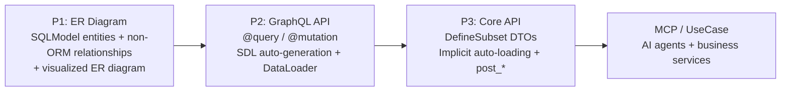
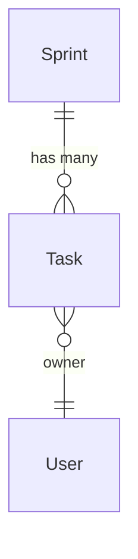

# nexusx

**nexusx** is a Python framework for building MCP-first, Agent-first
applications. Model your business entities, relationships, and use cases
once — MCP, GraphQL, REST, CLI, and TS SDK all derive from that single model,
sharing one DataLoader-backed query graph (N+1-proof) and one set of typed
DTOs (`DefineSubset`): semantic-level isomorphism, not transport-level wrapping.

## Run It in 60 Seconds

Install the dependencies:

```bash
pip install "nexusx[demo]"
```

Create `app.py`:

```python
from contextlib import asynccontextmanager

from fastapi import FastAPI
from fastapi.responses import HTMLResponse
from pydantic import BaseModel
from sqlalchemy.ext.asyncio import async_sessionmaker, create_async_engine
from sqlalchemy.pool import StaticPool
from sqlmodel import Field, Relationship, SQLModel
from sqlmodel.ext.asyncio.session import AsyncSession

from nexusx import AutoQueryConfig, GraphQLHandler


class BaseEntity(SQLModel):
    pass


class Team(BaseEntity, table=True):
    id: int | None = Field(default=None, primary_key=True)
    name: str
    heroes: list["Hero"] = Relationship(back_populates="team")


class Hero(BaseEntity, table=True):
    id: int | None = Field(default=None, primary_key=True)
    name: str
    team_id: int | None = Field(default=None, foreign_key="team.id")
    team: Team | None = Relationship(back_populates="heroes")


engine = create_async_engine(
    "sqlite+aiosqlite:///:memory:",
    poolclass=StaticPool,
)
session_factory = async_sessionmaker(
    engine,
    class_=AsyncSession,
    expire_on_commit=False,
)
handler = GraphQLHandler(
    base=BaseEntity,
    session_factory=session_factory,
    auto_query_config=AutoQueryConfig(),
)


@asynccontextmanager
async def lifespan(_app: FastAPI):
    async with engine.begin() as connection:
        await connection.run_sync(SQLModel.metadata.create_all)

    async with session_factory() as session:
        team = Team(name="Avengers")
        session.add(team)
        await session.flush()
        session.add(Hero(name="Spider-Man", team_id=team.id))
        await session.commit()

    try:
        yield
    finally:
        await handler.aclose()
        await engine.dispose()


app = FastAPI(lifespan=lifespan)


class GraphQLRequest(BaseModel):
    query: str


@app.get("/graphql", response_class=HTMLResponse)
async def graphiql() -> str:
    return handler.get_graphiql_html()


@app.post("/graphql")
async def graphql(request: GraphQLRequest):
    return await handler.execute(request.query)
```

Start the server:

```bash
uvicorn app:app --reload
```

Open `http://127.0.0.1:8000/graphql` and query:

```graphql
{
  Team {
    by_filter {
      id
      name
      heroes {
        id
        name
      }
    }
  }
}
```

You now have a generated GraphQL schema and batched relationship loading. See
the [Quick Start](./guide/quick_start.md) for the walkthrough.

## What You'll Get

| You want... | You write... | nexusx handles... |
|------|----------------|---------------------------|
| A GraphQL API | `@query` / `@mutation` decorators | SDL generation, DataLoader batch-loading |
| REST or use-case DTOs | `DefineSubset` + field declarations | Implicit auto-loading, N+1 prevention, ORM→DTO conversion |
| Derived fields | `post_*` methods | Auto-execute after nested data is ready |
| Cross-layer data flow | `ExposeAs`, `SendTo`, `Collector` | Pass context downward, aggregate results upward |
| Non-ORM relationships | `Relationship(...)` | Same DataLoader infrastructure, supports auto-loading |
| An AI-ready API | `create_single_app_mcp_server(base=...)` | Progressive MCP tool exposure |
| Split into microservices | `RemoteRelationship` / `federation_public` DTO | Homogeneous federation: read-model composition across services, entity body unchanged |

## Who Is This For

- **Backend developers** building GraphQL and REST APIs from SQLModel entities
- **Teams** that want auto-generated APIs once models stabilize — no more hand-written schemas
- **Projects** that need both GraphQL for flexibility and REST for delivery
- **AI integrations** that expose the same models to AI agents via MCP

## Learning Path



Every guide reuses the same business scenario so you can follow along step by step:



### Guide (Tutorial Path)

| Page | What You'll Learn |
|------|------------------------|
| [Quick Start](./guide/quick_start.md) | Get a GraphQL API running in 30 seconds |
| [ER Diagram & Non-ORM Relationships](./guide/er_diagram.md) | Declare and visualize entity relationships |
| [GraphQL Mode](./guide/graphql_mode.md) | The full workflow from SQLModel to GraphQL API |
| [GraphQL Pagination](./guide/graphql_pagination.md) | Paginate list relationships |
| [Auto Query](./guide/graphql_auto_query.md) | Skip `@query` and auto-generate `by_id` / `by_filter` |
| [Core API Mode](./guide/core_api.md) | Build REST responses with `DefineSubset` + implicit auto-loading |
| [Core API Advanced](./guide/core_api_advanced.md) | Use `resolve_*` / `post_*` / cross-layer data flow |
| [Custom Relationships](./guide/custom_relationship.md) | Declare and use non-ORM relationships |
| [Virtual Entities](./guide/virtual_entities.md) | Use plain `BaseModel` roots (`CurrentUser`, page wrappers, third-party DTOs) via `add_virtual_entities()` |
| [ER Diagram Visualization](./guide/er_diagram_visual.md) | Generate and embed Mermaid ER diagrams |

### Advanced Guides

| Page | What You'll Learn |
|------|-------|
| [Cross-Service Federation](./advanced/federation.md) | Homogeneous federation: evolve a monolith into microservices incrementally, read-model composition across services (β entity graph / γ DTO) |
| [MCP Service](./advanced/mcp_service.md) | Expose SQLModel APIs to AI agents |
| [UseCase Service](./advanced/use_case_service.md) | Define business services serving both MCP and REST |
| [UseCase + FastAPI](./advanced/use_case_fastapi.md) | Embed the same service class into FastAPI routes |
| [Voyager Visualization](./advanced/voyager.md) | Interactive ERD browsing |

### API Reference

- [GraphQLHandler](./api/api_graphql_handler.md) — GraphQL entry point + SDL generation
- [Core API](./api/api_core.md) — ErManager / Resolver / DefineSubset / Loader
- [Cross-layer Data Flow](./api/api_cross_layer.md) — ExposeAs / SendTo / Collector
- [Relationships & ER Diagram](./api/api_relationship.md) — Relationship / ErDiagram
- [MCP API](./api/api_mcp.md) — MCP service configuration
- [UseCase API](./api/api_use_case.md) — UseCaseService / create_use_case_graphql_mcp_server
