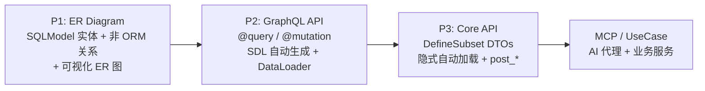
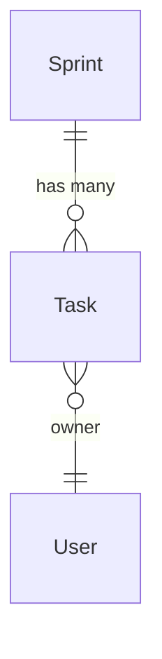

# nexusx

**nexusx** 是一个构建 MCP 优先、Agent 优先应用的 Python 框架。把业务实体、关系与用例建模一次，MCP、GraphQL、REST、CLI 与 TS SDK 全部由此派生，共享同一个 DataLoader 批量加载的查询图（无 N+1）和一套类型化 DTO（`DefineSubset`）：语义级同构，而非传输层包装。

## 60 秒运行起来

安装依赖：

```bash
pip install "nexusx[demo]"
```

创建 `app.py`：

```python
from contextlib import asynccontextmanager

from fastapi import FastAPI
from fastapi.responses import HTMLResponse
from pydantic import BaseModel
from sqlalchemy.ext.asyncio import async_sessionmaker, create_async_engine
from sqlalchemy.pool import StaticPool
from sqlmodel import Field, Relationship, SQLModel
from sqlmodel.ext.asyncio.session import AsyncSession

from nexusx import AutoQueryConfig, GraphQLHandler


class BaseEntity(SQLModel):
    pass


class Team(BaseEntity, table=True):
    id: int | None = Field(default=None, primary_key=True)
    name: str
    heroes: list["Hero"] = Relationship(back_populates="team")


class Hero(BaseEntity, table=True):
    id: int | None = Field(default=None, primary_key=True)
    name: str
    team_id: int | None = Field(default=None, foreign_key="team.id")
    team: Team | None = Relationship(back_populates="heroes")


engine = create_async_engine(
    "sqlite+aiosqlite:///:memory:",
    poolclass=StaticPool,
)
session_factory = async_sessionmaker(
    engine,
    class_=AsyncSession,
    expire_on_commit=False,
)
handler = GraphQLHandler(
    base=BaseEntity,
    session_factory=session_factory,
    auto_query_config=AutoQueryConfig(),
)


@asynccontextmanager
async def lifespan(_app: FastAPI):
    async with engine.begin() as connection:
        await connection.run_sync(SQLModel.metadata.create_all)

    async with session_factory() as session:
        team = Team(name="Avengers")
        session.add(team)
        await session.flush()
        session.add(Hero(name="Spider-Man", team_id=team.id))
        await session.commit()

    try:
        yield
    finally:
        await handler.aclose()
        await engine.dispose()


app = FastAPI(lifespan=lifespan)


class GraphQLRequest(BaseModel):
    query: str


@app.get("/graphql", response_class=HTMLResponse)
async def graphiql() -> str:
    return handler.get_graphiql_html()


@app.post("/graphql")
async def graphql(request: GraphQLRequest):
    return await handler.execute(request.query)
```

启动服务：

```bash
uvicorn app:app --reload
```

打开 `http://127.0.0.1:8000/graphql`，执行：

```graphql
{
  Team {
    by_filter {
      id
      name
      heroes {
        id
        name
      }
    }
  }
}
```

至此已经得到自动生成的 GraphQL schema 和批量关系加载。完整说明见
[快速开始](./guide/quick_start.zh.md)。

## 你能得到什么

| 你想要... | 你写... | nexusx 负责... |
|------|----------|--------------|
| 一个 GraphQL API | `@query` / `@mutation` 装饰器 | SDL 生成、DataLoader 批量加载 |
| REST 或用例 DTO | `DefineSubset` + 字段声明 | 隐式自动加载、N+1 预防、ORM→DTO 转换 |
| 派生字段 | `post_*` 方法 | 在嵌套数据就绪后自动执行 |
| 跨层传递数据 | `ExposeAs`、`SendTo`、`Collector` | 向下传上下文，向上聚合结果 |
| 非 ORM 关系 | `Relationship(...)` | 同一 DataLoader 基础设施，支持自动加载 |
| 一个 AI 就绪的 API | `create_single_app_mcp_server(base=...)` | 渐进式 MCP 工具暴露 |
| 拆成微服务 | `RemoteRelationship` / `federation_public` DTO | 同构联邦：读模型跨服务组合，entity 主体不动 |

## 适合谁

- **后端开发者**：从 SQLModel 实体快速构建 GraphQL 和 REST API
- **团队**：模型稳定后自动生成 API，不再手写 schema
- **项目**：同时需要 GraphQL 的灵活性和 REST 的交付能力
- **AI 集成**：将同一套模型通过 MCP 暴露给 AI 代理

## 学习路径



所有指南复用同一套业务场景，你可以跟着一步步操作：



### 指南（教程路径）

| 页面 | 你将学到什么 |
|---|---|
| [快速开始](./guide/quick_start.zh.md) | 30 秒跑起来一个 GraphQL API |
| [ER 图与非 ORM 关系](./guide/er_diagram.zh.md) | 声明和可视化实体关系 |
| [GraphQL 模式](./guide/graphql_mode.zh.md) | 从 SQLModel 到 GraphQL API 的完整流程 |
| [GraphQL 分页](./guide/graphql_pagination.zh.md) | 列表关系的分页支持 |
| [自动查询](./guide/graphql_auto_query.zh.md) | 跳过 `@query`，自动生成 `by_id` / `by_filter` |
| [Core API 模式](./guide/core_api.zh.md) | 用 `DefineSubset` + 隐式自动加载构建 REST 响应 |
| [Core API 进阶](./guide/core_api_advanced.zh.md) | 使用 `resolve_*` / `post_*` / 跨层数据流 |
| [自定义关系](./guide/custom_relationship.zh.md) | 声明和使用非 ORM 关系 |
| [虚拟实体](./guide/virtual_entities.zh.md) | 通过 `add_virtual_entities()` 使用普通 `BaseModel` 根（`CurrentUser`、页面 wrapper、第三方 DTO） |
| [ER 图可视化](./guide/er_diagram_visual.zh.md) | 生成和嵌入 Mermaid ER 图 |

### 进阶指南

| 页面 | 你将学到什么 |
|---|---|
| [跨服务联邦](./advanced/federation.zh.md) | 同构联邦：单体渐进演化成微服务，读模型跨服务组合（β 实体图 / γ DTO） |
| [MCP 服务](./advanced/mcp_service.zh.md) | 将 SQLModel API 暴露给 AI 代理 |
| [UseCase 服务](./advanced/use_case_service.zh.md) | 定义业务服务，同时服务于 MCP 和 REST |
| [UseCase + FastAPI](./advanced/use_case_fastapi.zh.md) | 同一服务类嵌入 FastAPI 路由 |
| [Voyager 可视化](./advanced/voyager.zh.md) | 交互式 ERD 浏览 |

### API 参考

- [GraphQLHandler](./api/api_graphql_handler.zh.md) — GraphQL 入口 + SDL 生成
- [Core API](./api/api_core.zh.md) — ErManager / Resolver / DefineSubset / Loader
- [跨层数据流](./api/api_cross_layer.zh.md) — ExposeAs / SendTo / Collector
- [关系与 ER 图](./api/api_relationship.zh.md) — Relationship / ErDiagram
- [MCP API](./api/api_mcp.zh.md) — MCP 服务配置
- [UseCase API](./api/api_use_case.zh.md) — UseCaseService / create_use_case_graphql_mcp_server
